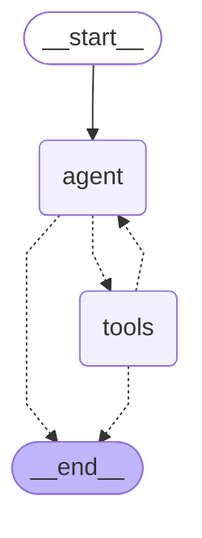

# Donna LangGraph Architecture

Native export from the production ReAct ``StateGraph`` via
``CompiledGraph.get_graph().draw_mermaid()``
(``donna.agentic_react_graph.compile_donna_react_graph``).

## Graph



## Topology notes (for routing audits)

| Edge / path | Meaning |
|---|---|
| `START -> agent` | Every developer/vision/research turn enters the ReAct router/synthesis node. |
| `agent -> tools` | Conditional: last AI message has ``tool_calls`` (native bind_tools or recovered JSON). |
| `agent -> END` | Conditional: ``halt`` or no tool calls (spoken final answer). |
| `tools -> agent` | Continue ReAct after tool observations (unless ``halt``). |
| `tools -> END` | Max-iters / forced halt after tools. |

### Outside this diagram (still part of live routing)

These policies run **before** or **inside** node bodies - they do not add extra
LangGraph nodes, but matter when auditing starvation / vision bugs:

- **Mode foresight** (`donna.agentic.get_donna_mode`): chat bypasses this graph;
  vision/research keep ReAct and may force ``analyze_visual_context`` into the
  bind set via ``merge_bound_tool_ids``.
- **Broker foresight** (`IntentBroker.parse_utterance`): may seed a forced tool
  into the agent node before the first LLM step.
- **Explicit tool merge**: tool ids spelled in the user text are always_include'd
  so mode overrides cannot starve e.g. ``draft_cursor_prompt``.
- **Vision JIT**: ``analyze_visual_context`` executes inside the ``tools`` node
  (direct YOLO path), not as a separate graph node.

Regenerate with:

```bash
python -m donna.tools.export_graph
```
